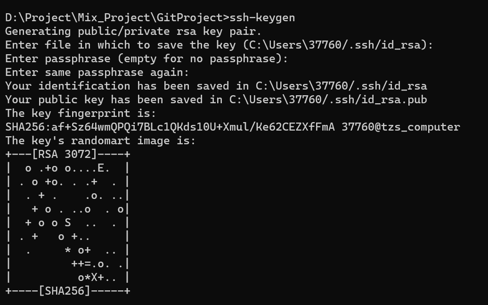

# 为什么要用git

常规的管理过于麻烦，占用内存也大

git只是用文本信息存储文件的更改

多人管理文件需要手动合并也很麻烦

版本管理大概分两种 集中式和分布式

**集中式**例如svn

流程：本地只存储拷贝文件，从中央服务器下载文件，每次修改都提交到中央服务器处理

优点操作简单，用户不用考虑合并问题，缺点是有可能有单节点故障问题，中央服务器出问题就都用不了了

分布式 git为主

git是每个用户本地都保存一个完整的文件，然后可以离线修改，不同文件之间可以进行版本合并

# git的安装和配置

# 新建仓库

本地直接创建git init  从远程拉去 git clone

会有一个git文件夹，记录版本信息

直接git init会把当前文件夹变成git仓库，如果git init xxx则在当前文件夹下xxx文件夹下创建git仓库

其实git仓库没有什么特别的处理，就是有了一个init文件夹来管理文件

同时 git clone  xxxx（网址）也可也直接从网络上拉去git仓库

# 工作区域和文件状态

工作区就是整个文件夹

暂存区和本地仓库都是存在git文件夹下的两个区间

通过add和commit命令进行操作

为什么要有暂存区，而不是工作区直接提交到本地仓库呢？

个人理解是，暂存区做为一个缓存，减少工作区直接提交到本地仓库的消耗

比如  add 10次 commit一次 大概率小于直接commit 10次

文件类型也分为4种

未跟踪是指的未被git记录的，git后会直接加入暂存区域

暂存区域的文件修改后会在已修改区域生成一个副本，如果将已修改的再次暂存就会合并

# 添加和提交文件

git status查看文件状态，主要显示未跟踪，已修改未提交的文件

git add  xx文件   这个参数也可以是文件夹，或者是通配符

git每台机器都必须自报家门，所以

git config --global user.name "tzs"

git config --global user.email "377603002@qq.com"

git commit必须加 -m设置备注信息，否则会强制提示需要备注

git log   /git log oneline  查看提交信息

# 回退版本

git mixed是默认参数

git soft/mix使用在连续提交多个版本但是没啥意义，可以回退到第一个版本，然后重新从暂存区提交。混合模式需要重新add一下

git hard是真的放弃本地所有修改内容

git reflog可以查看所有操作

git reset --hard  xxx（版本号）

# 查看差异

git diff

个人感觉这个没啥要用的

# 删除文件

直接删除，然后git add提交到暂存区

使用 git rm删除  

# gitignore忽略

# *划重点

刀这里为止，只有两个地方需要注意

1.知道工作区域和文件状态这个概念，具体操作不用记，会add，commit即可

2.知道回退版本操作

# SSH配置和克隆仓库

http的方式git仓库可以直接获取但是不便于push，提交需要验证

ssh的方式进行提交就是把公钥和git账号进行绑定，等于是获得了账号的权限。一般不额外设置密码，通过公钥的配置就可以完成

## 生成本地密钥

直接使用ssh-keygen即可

把本地生成的key配置到tzs758

但是提交之后居然是tzs12138！！！！

可能是之前的信息没有删除干净？？ 

理论上，我现在电脑里面的ssh配置到tzs758里面，就应该是做了一个绑定了，但是呢？难道还有其他的ssh，然后默认使用的原来的？

但是我原来的tzs12138应该也没权限才对阿！！

最后发现是本地git email配置的问题，会显示本地git email对应的账号

# 关联本地仓库和远程仓库

一般远程仓库的别名为origin

# 分支操作

不涉及到冲突还是很好解决的

