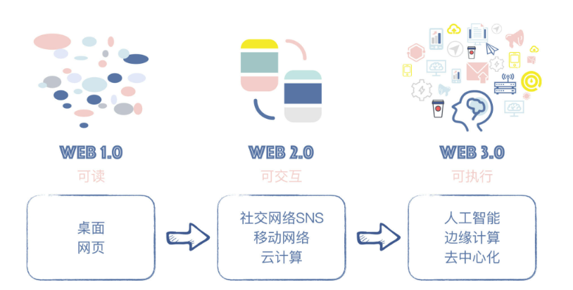

# 1.为什么需要web3.0

## 什么是web3.0

1.0用户从网页获取知识 

2.0开始移动网络，交互等

3.0其实还没有定义，但是已经有了一些概念

当下的一些变化，数据是谁存储谁有，一些互联网公司拥有了国家一般的权力。例如社交媒体禁言，数据泄露分析。

web3.0的架构就是打算改变这种方式

web3.0就是一系列的硬件，软件，包括协议架构等的东西

# 一些重要概念

粗略了解后，发现很多东西都没有意义，遂放弃

以太坊

区块链

# 我的感悟

目前感觉纯粹的金融骗局，貌似去中心化实则资本还是可以通过前期的积累进行控制。而后发资本没有积累，更加难以超越前者。