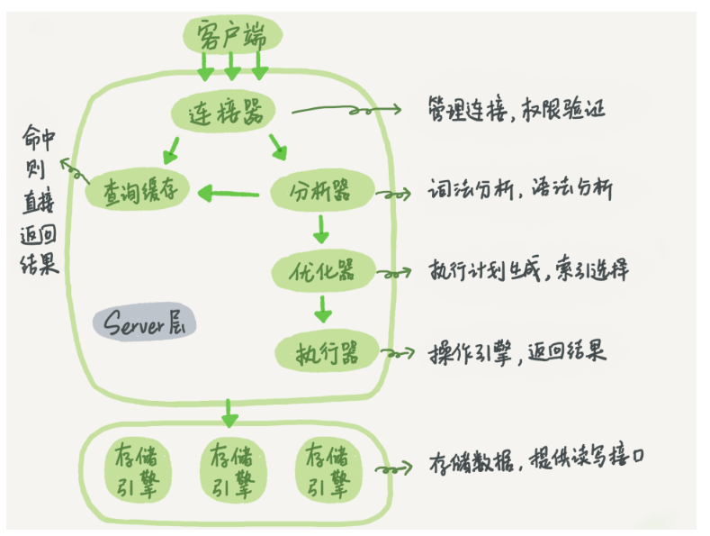
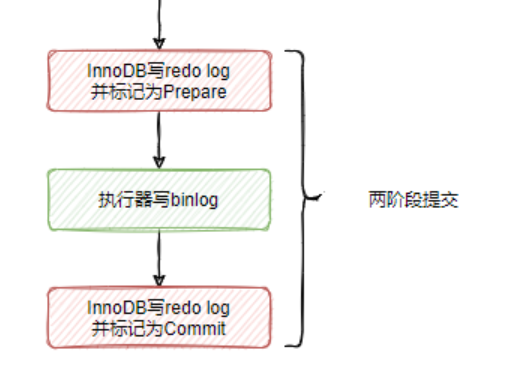
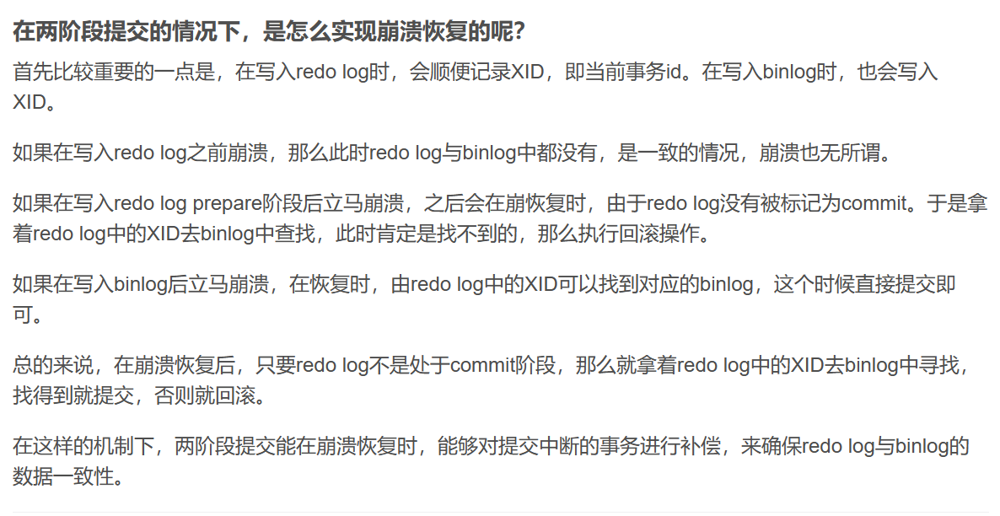
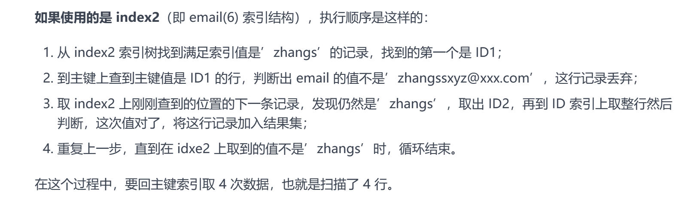
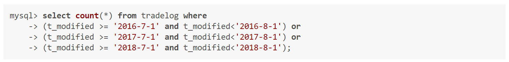

# 0 开篇词

原理先行，再实践验证

# 1 基础架构

分为server层和存储引擎两部分



## 连接器

负责跟客户端进行连接

连接成功后，权限不会被改变。太长时间未响应会自动断开。wait_timeout控制

长连接是有持续请求，一直使用同一个连接，短连接则执行几次就断开。由于建立连接的开销不小，所以推荐用长连接。

全部使用长连接可能占用内存特别快，这是因为MySQL执行过程中使用的内存是管理在连接对象里面的，断开连接时才释放。

解决方法有两种，定期断开长连接，使用5.7以上版本有mysql_reset_connection操作，可以重新初始化连接资源。

## 查询缓存

查到缓存就可以省掉执行器等过程，但是mysql表修改后，缓存都会失效。

可以使用按需使用的方式，全局不使用缓存，对于对应的静态表进行使用缓存。

8.0后删除了这个缓存的功能

## 分析器

对SQL语句进行解析

## 优化器

一个语句有多种执行方案，但是执行的效率会有不同，而优化器的作用就是决定选择使用哪一个方案。

## 执行器

在缓存查询/优化器之前会进行权限校验

执行操作，仔细讲解有后续

## 小结

本章节主要是有个初步印象

连接器这样，连上之后就权限不变了好么？如果我设计估计会，改完权限后要求这个连接重连。也不行，万一是生产环境，最好是不要动。

缓存，这个mysql的缓存其实和其他外部缓存就挺冲突的，一些频繁访问的完全可以重新抽取一层出来，比如redis这样的中间件。但是8.0居然直接全部删掉了，意味着职责单一化？或许早几个版本就没啥人用了

# 2.日志

redo log 重做日志

binlog 归档日志

redo 是innoDB特有的，binlog是MySQL server层实现的

redo是物理日志，记录修改内容，是固定空间循环写。物理内容，例如 "Page 42:image at 367,2; before:'ke';after:'ca'"。记录了修改内容（或修改前后内容），具体的位置

binlog是逻辑日志，追加写的。CameraLingo:update(0,'Kermera'=>'camera')，相当于记录的修改操作，执行命令。

|          | binlog             | redo log     |
| -------- | ------------------ | ------------ |
| 归属     | MySQL server层实现 | innoDB特有的 |
| 类型     | 逻辑日志           | 物理日志     |
| 写入方式 | 追加写             | 循环写       |
| 使用场景 | 主从同步与误删恢复 | 崩溃循环     |


## 两阶段提交

分布式事务的两阶段提交：投票，提交。所有事务进行投票，都同意后（或者满足一定条件后），进行提交阶段。






# 3.事务

ACID（Atomicity、Consistency、Isolation、Durability，即原子性、一致性、隔离性、持久性

脏读，事物a读取了b未提交的数据

不可重复读，事物a进行的过程中数据变化了，无法重复读取。

幻读，读取时两次数据总量不一致

下面主要讲隔离性

一个基本原则，隔离的越严实，效率就会越低

4种层级 读未提交，读提交，可重复读，串行化

- 读未提交是指，一个事务还没提交时，它做的变更就能被别的事务看到。
- 读提交是指，一个事务提交之后，它做的变更才会被其他事务看到。防止脏读
- 可重复读是指，一个事务执行过程中看到的数据，总是跟这个事务在启动时看到的数据是一致的。当然在可重复读隔离级别下，未提交变更对其他事务也是不可见的。防止不可重复读和脏读
- 串行化，顾名思义是对于同一行记录，“写”会加“写锁”，“读”会加“读锁”。当出现读写锁冲突的时候，后访问的事务必须等前一个事务执行完成，才能继续执行。

不同的业务场景，需要不同的隔离程度

长事物有风险，长连接不注意可能导致长事物。比如set autocommit=0，这个命令会将这个线程的自动提交关掉，到时候忘了提交就会导致长事物

## 小结

简单讲了事物的隔离性，那么mysql默认隔离呢？默认是可重复度，innoDB引擎使用的是Next-Key Lock 锁算法

实际开发中，读提交比较多。减少锁提高并发度

简单想想各种隔离程度怎么实现的：

读未提交，就是直接改；

读提交，单独拷贝，提交之后跟新到主分支；

可重复读，每次读之前拷贝一份，从拷贝里面读，提交后再同步。会有脏读问题？

串行化，那就是变成线性的了。

了解的脏读幻读的概念后，这样的想法明显不对，没有这么简单。所以是有专门的锁算法的，例如可重复读的Next-Key Lock 锁算法

**可重复读，幻读**：定义有一点模型，很多说法都不一样。暂定，对于相同条件，多出来的数据为幻读。

# 4.索引

这个章节还挺重要的，肯定不可能一遍就看懂

索引的目的是为了提高查询的效率

三种常见索引：

**哈希表**：处理哈希重复问题（开放地址法，再哈希，链地址法，建立公共溢出栈）

只适用于等值查询，如果是范围查询很困难

**有序数组**

适合范围查询，只适合静态存储，不太适合变化

**搜索树**


养成一种想法，了解一种数据库时，先去了解他的底层实现

## InnoDB的索引模型(常考点)

B+树的概念，为了配合好磁盘（机器硬盘）的读写特性

个人感觉：在固态硬盘里面，IO成本变低了，B+树可能不是最优选择。红黑树，跳表等都有一定研究价值。具体还得看

由于索引维护，普通索引需要回表等问题

实践中尽可能采用主键索引，使用自增主键

# 5.索引下

搜索时要尽量避免回表，如果非主键索引的搜索已经覆盖了搜索信息，就不用回表了，这叫**索引覆盖**，是常见优化手段

例如：

```sql
select ID from T where k between 3 and 5sql
```

id是主键，k是一个字段，这个sql从k上搜索，然后只取了id，所以不用回表

**一个表能有多个主键索引么？**

**如果一个字段没有索引，那么如何搜索呢？全局搜索？还是说，都有默认索引？**没有索引则全局扫描


建立（a,b,c）索引相当于有了a,(a,b),(a,b,c)三个索引，这就是最**左匹配原则**，这个联合索引会按照a,b,c的大小顺序排列（两个对象，a小的在前，a相同则b在小在前......）,考虑空间优化的话，假设a字段大，b小，同时需要a,b,(a,b)的索引，那么应该创建（a,b）,b这样比a，(a,b)占用的空间小。


**索引下推**，可以滤掉不需要的数据。以市民表的联合索引（name, age）为例

**select** * **from** tuser **where** name **like** '张 %' **and** age=10 **and** ismale=1;

则先判断，姓名和年轻，不符合就不回表了，符合再回表去主键中看是否符合条件

# 6.全局锁和表锁

全局锁，表锁，行锁

本章主要就是介绍了一下全局锁和表锁

全局锁经常用于全局逻辑备份

隔离级别选用要考虑引擎，MyISAM 这种不支持事务的引擎，可以考虑升级引擎

# 7.行锁的功过

锁是为了保证数据的一致性，并发安全等，但也因此减少了并行度。

**两阶段锁**

在 InnoDB 事务中，行锁是在需要的时候才加上的，但并不是不需要了就立刻释放，而是要等到事务结束时才释放。这个就是两阶段锁协议

目的是防止事务的层叠回退，分布式课又讲

**死锁与死锁检测**

死锁的原因就不多说了

死锁检测有一定的资源损耗，一般来说，是O(n^2)的时间复杂度，对于每个线程O(n),所以n个线程是O(n^2)

解决思路一：确保不会有死锁，临时关闭死锁检测。当然这伴随着风险，因为写业务的时候不会去刻意考虑资源是否产生死锁

解决思路二：并发控制，让一个资源竞争的线程有限。

比如本来是10000个线程竞争100个资源，现在分10组，每1000个竞争10个，那么死锁的检测成本就变低了。当然极限100竞争1个，可能并发度就低了，所以颗粒度的选择很重要。

通过控制流量，比如100个资源，已经有5000个线程在竞争了，就不让其他线程再进去了。这个数值就是一个具体情况具体分析了。

控制的方法可以通过中间件，或者直接修改mysql源码。

**我个人感觉还是用中间件比较好，现在mysql都不搞缓存了，可能就是想着有redis啥的这一类中间件。当然还是要具体分析，如果团队本身有能改源码实现的人，成本更低肯定可以考虑。如果都不会，都是现学，那还是建议学中间件，至少耦合性没那么高**

# 8.

没看懂

# 9.普通索引和唯一索引

唯一索引是所有key值不重复的索引

**缓冲池**(buffer pool)机制，避免每次访问磁盘，以加速数据的访问。

change buffer**更新缓存**，当需要修改的内容页在内存中时，直接更改。否则放入change buffer，访问对应页的数据时会merge，将change buffer同步到磁盘中，除了访问一般系统也会定期merge。

change buffer占用buffer pool，innodb_change_buffer_max_size 来动态设置。这个参数设置为 50 的时候，表示 change buffer 的大小最多只能占用 buffer pool 的 50%。


**查询**

主键索引找到对应值后停止

普通索引找到对应值后继续找下一个，直到不相同为止。

但是一个页的数据都被读进内存，所以在内存中读下一个数据并不消耗太多资源。主要的资源消耗在于磁盘的随机io

**更新**

唯一索引无法使用change buffer，因为唯一索引更新时需要判断是否相同，判断操作只能发生在内存

**这个记录要更新的目标页不在内存中**。这时，InnoDB 的处理流程如下：

- 对于唯一索引来说，需要将数据页读入内存，判断到没有冲突，插入这个值，语句执行结束；
- 对于普通索引来说，则是将更新记录在 change buffer，语句执行就结束了。

将数据从磁盘读入内存涉及随机 IO 的访问，是数据库里面成本最高的操作之一。change buffer 因为减少了随机磁盘访问，所以对更新性能的提升是会很明显的。

**change buffer的局限性**

对于写多读少的业务来说，页面在写完以后马上被访问到的概率比较小，此时 change buffer 的使用效果最好。这种业务模型常见的就是账单类、日志类的系统。

反过来，假设一个业务的更新模式是写入之后马上会做查询，那么即使满足了条件，将更新先记录在 change buffer，但之后由于马上要访问这个数据页，会立即触发 merge 过程。这样随机访问 IO 的次数不会减少，反而增加了 change buffer 的维护代价。

尽管如此，普通索引和 change buffer 的配合使用，对于数据量大的表的更新优化还是很明显的。

# *内存，外存，磁盘，缓存，固态硬盘，机器硬盘，磁盘的概念

内存，缓存，外存，（磁盘？）是一个逻辑概念

机器硬盘，固态硬盘是物理的概念

何为IOPS？

iops：**（总的读+写的操作量）/ 时间（秒）**

# 10.mysql有时候会选错索引

选择索引是优化器的工作

mysql通过“采样统计”的方法估计扫描行，因此有时候会出现估计错误。

可以通过force index(a)，这样的操作来强制选择索引

# 11.怎么给字符串字段加索引

MySQL 是支持前缀索引，给字符串加索引可以使用前缀索引

**alter** **table** SUser **add** index index2(email(6));

将email的前六个字符做为索引

前缀索引避免了整个字符串的存储，可以有效节省空间，但是可能因为区分度不足，查询是需要多次回表比对。



因此，需要制定适当的索引长度，均衡好区分度和空间

```sql
mysql> select 
  count(distinct left(email,4)）as L4,
  count(distinct left(email,5)）as L5,
  count(distinct left(email,6)）as L6,
  count(distinct left(email,7)）as L7,
from SUser;
```

可以使用distinct语句来计算机区分度，看是否在可承受范围内

此外，前缀索引会影响索引覆盖。例如：

**select** id,email **from** SUser **where** email='zhangssxyz@xxx.com';

前缀索引就必须回表，从主索引中去获取email信息


遇到**前缀特别容易重复的情况，例如身份证号**可以采用

倒叙存储，及使用后几位

hash字段

# 12.为什么我的MySQL会“抖”一下？

条 SQL 语句，正常执行的时候特别快，但是有时也不知道怎么回事，它就会变得特别慢，并且这样的场景很难复现，它不只随机，而且持续时间还很短。这一般是**flush刷脏页**机制导致的

**当内存数据页跟磁盘数据页内容不一致的时候，我们称这个内存页为“脏页”。内存数据写入到磁盘后，内存和磁盘上的数据页的内容就一致了，称为“干净页”**。

刷脏页有四种情况

1.innoDB 的 redo log 写满了。这时候系统会停止所有更新操作，把 checkpoint 往前推进

2.是系统内存不足。当需要新的内存页，而内存不够用的时候，就要淘汰一些数据页，空出内存给别的数据页使用。如果是在脏页，则需要flush

3.不忙的时候，定期执行

4.关闭之前执行

其中3.4对于性能影响不大，1.2会影响性能

1. 一个查询要淘汰的脏页个数太多，会导致查询的响应时间明显变长；
2. 日志写满，更新全部堵住，写性能跌为 0，这种情况对敏感业务来说，是不能接受的。

所以，InnoDB 需要有控制脏页比例的机制，来尽量避免上面的这两种情况。

**正确的控制刷脏页策略**

innodb_io_capacity ，它会告诉 InnoDB 你的磁盘能力。这个值我建议你设置成磁盘的 IOPS。磁盘的 IOPS 可以通过 fio 这个工具来测试

innodb_max_dirty_pages_pct 是脏页比例上限，默认值是 75%

通过这两个参数来控制脏页的比例

脏页太少等于没有很好的利用内存去进行读，太多则在读写的时候经常出现出现flush现象，所以sql执行经常变慢


此外还有innodb_flush_neighbors，当这个值为1时，刷脏页会将相邻的一个页，如何也是脏页就一起刷了。找“邻居”这个优化在机械硬盘时代是很有意义的，可以减少很多随机 IO。但是对于固态硬盘就没有那么明显。mysql8.0之前默认为1，之后默认为0


**数据库多大的表才算是大表？**

一个学校的总人数这种数据量，50 年才 100 万学生，这个表肯定是小表。

阿里巴巴《Java 开发手册》提出单表行数超过 500 万行或者单表容量超过 2GB，才推荐进行分库分表

总之，对于这些优化不应该过度设计

# 13.为什么删掉表数据，表文件大小不变

一个 InnoDB 表包含两部分，即：表结构定义和数据。 

在8.0之前有单独的.frm文件，在这之后表结构可以数据表里面了，表结构占比很小。

**数据字典的含义**：在MySQL中，数据字典信息内容就包括表结构、数据库名或表名、字段的数据类型、视图、索引、表字段信息、存储过程、触发器等内容。

表数据既可以存在共享表空间里，也可以是单独的文件。这个行为是由参数 innodb_file_per_table 控制的：

建议为on，一个表单独存储更加方便

1. 这个参数设置为 OFF 表示的是，表的数据放在系统共享表空间，也就是跟数据字典放在一起；
2. 这个参数设置为 ON 表示的是，每个 InnoDB 表数据存储在一个以 .ibd 为后缀的文件中。

删数据的流程：

删掉某个数据，只会在磁盘上标记为已删，这个磁盘空间没法马上得到应用，于是造成了**“空洞”**

此外，插入数据造成的页的分裂也会造成**空洞**

重建表可以解决空洞问题

# *MySQL可重复读的实现原理

可重复读是InnoDB的默认隔离级别，在mysql中通过多版本并发控制MVVC实现，

# 14.为什么cout（*）这么慢

因为并发的存在，每个事务无法知道表有多少（不同事务见到的表数量可能不同），所以需要每次都遍历一遍，innoDB是这样实现的。

纯粹的遍历，cout也是有优化的，cout(*)会去遍历最小的树（从节点肯定比主节点小，从节点相比最小的），**在保证逻辑正确的前提下，尽量减少扫描的数据量，是数据库系统设计的通用法则之一。**

**对于 count(主键 id) 来说**，InnoDB 引擎会遍历整张表，把每一行的 id 值都取出来，返回给 server 层。server 层拿到 id 后，判断是不可能为空的，就按行累加。

**对于 count(1) 来说**，InnoDB 引擎遍历整张表，但不取值。server 层对于返回的每一行，放一个数字“1”进去，判断是不可能为空的，按行累加。

**但是 count(\*) 是例外**，并不会把全部字段取出来，而是专门做了优化，不取值。

## 解决方案

**使用缓存系统**，例如使用redis

保存一个数来记录，当插入一条数据+1，减少则-1

更新丢失：缓存是不持久的，可能丢失。可以每次丢失后，重新读mysql，所以更新丢失是可以解决的

逻辑不正确：无论是先+1，还是先插入数据，如果有线程在这两个中间查询，就会存在逻辑不正确

**接放到数据库里单独的一张计数表 C**

更新丢失直接不存在了

可以通过**事务**解决逻辑不正确，将+1和插入数据作为一个事务，全部执行完之前对外不可见。


**why**？为什么缓存就不能实现事务了呢？事务是不是不能跨不同的组件？

# 16 “order by”是怎么工作的？

**全字段排序**

利用索引取出整行的数据，然后在sort缓存中排序

**rowId排序**

利用索引取出整行中参与排序的数据，在sort缓存中排序，最后从sort缓存中根据主键id查询整行数据

两者的区别：

全字段排序内存占用大，rowid需要查询两次，磁盘访问开销更大

体现了 MySQL 的一个设计思想：**如果内存够，就要多利用内存，尽量减少磁盘访问。**

# 17.如何正确的显示随机消息

直观的方法：**select** word **from** words order **by** **rand**() limit 3;

使用order **by** **rand**()来获取随机，但是这背后是如何实现的呢？

# 18.SQL语句逻辑相同，但是性能差距巨大

**对索引字段做函数操作，可能会破坏索引值的有序性，因此优化器就决定放弃走树搜索功能**

## 条件字段操作函数

mysql> **select** count(*) **from** tradelog **where** **month**(t_modified)=7;

用到了month函数所以没法利用索引

把 SQL 语句改成基于字段本身的范围查询。按照下面这个写法，优化器就能按照我们预期的，用上 t_modified 索引的快速定位能力了。



当然这样还是挺麻烦的，后续有新的年份还需要继续添加

## 隐式类型转化