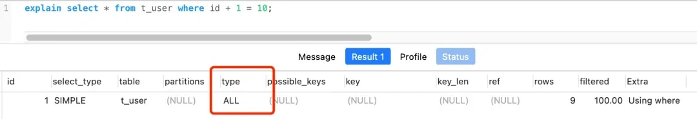

# 1.基础架构

分为server层和存储引擎两部分

## server层

连接器-分析器-优化器-执行器

#### 连接器

负责跟客户端进行连接

连接成功后，权限不会被改变。太长时间未响应会自动断开。wait_timeout控制

长连接是有持续请求，一直使用同一个连接，短连接则执行几次就断开。由于建立连接的开销不小，所以推荐用长连接。

全部使用长连接可能占用内存特别快，这是因为MySQL执行过程中使用的内存是管理在连接对象里面的，断开连接时才释放。

解决方法有两种，定期断开长连接，使用5.7以上版本有mysql_reset_connection操作，可以重新初始化连接资源。

#### 查询缓存

查到缓存就可以省掉执行器等过程，但是mysql表修改后，缓存都会失效。

可以使用按需使用的方式，全局不使用缓存，对于对应的静态表进行使用缓存。

8.0后删除了这个缓存的功能

#### 分析器

对SQL语句进行解析

#### 优化器

一个语句有多种执行方案，但是执行的效率会有不同，而优化器的作用就是决定选择使用哪一个方案。

#### 执行器

执行sql语句

## 存储引擎

最常见的是InnoDB/MyISAM

5.5之前默认的是MyISAM，后续默认是innoDB

innoDB的主要优势是支持事务，支持行锁（更细粒度的锁机制），支持外键

MyISAM的优势是不考虑事务等查询更高效，支持表压缩

比较值得注意的是：索引的数据结构，日志是与存储引擎有关系的。


# 2.索引

索引是一种提高搜索效率的工具

常见的索引:hash,B+树

innoDB的索引：B+树

什么时候加索引/如何加索引

主键索引和非主键索引：主键索引存储了所有信息，非主键索引只存储了索引和主键索引的地址

聚簇索引和非聚簇索引：聚簇索引决定了数据存储的物理位置，具有唯一性，一般主键索就是聚簇索引；如果没有主键索引，会选择第一个唯一索引。

索引什么时候会失效：

首先排除索引不会命中的情况

1.索引列使用了函数

2.多个列使用了or语句，并不是每列都有索引

3.数据类型不匹配，发生了隐数据转化

4.范围查找，或者like模糊匹配后面的语句

5.数据量太小，或者数据不够离散，优化器觉得不走索引更快。

如何避免/减少回表：

mysql为什么会选错索引

为什么是B+树

和哈希，容易冲突解决哈希冲突又很麻烦，java8 链表到红黑树

红黑树太高，不好利用磁盘的io

和b树比：B+树只有叶子结点存储数据（可以更矮，查询更稳定），结点之间有指向下一个节点的链表（可以更好的支持范围查找）；B+树更好的利用磁盘的预读原理，高度低。

和跳表之类的比

# 3.事务

事务是用来保证一组数据的完整性和一致性

事务的性质：ACID（Atomicity、Consistency、Isolation、Durability，即原子性、一致性、隔离性、持久性

脏读，事物a读取了b未提交的数据

不可重复读，事物a进行的过程中数据变化了，无法重复读取。

幻读，读取时两次数据总量不一致

## 隔离性

一个基本原则，隔离的越严实，效率就会越低

4种层级 读未提交，读提交，可重复读，串行化

- 读未提交是指，一个事务还没提交时，它做的变更就能被别的事务看到。
- 读提交是指，一个事务提交之后，它做的变更才会被其他事务看到。防止脏读
- 可重复读是指，一个事务执行过程中看到的数据，总是跟这个事务在启动时看到的数据是一致的。当然在可重复读隔离级别下，未提交变更对其他事务也是不可见的。防止不可重复读和脏读，但是有幻读情况。
- 串行化，顾名思义是对于同一行记录，“写”会加“写锁”，“读”会加“读锁”。当出现读写锁冲突的时候，后访问的事务必须等前一个事务执行完成，才能继续执行。

不同的业务场景，需要不同的隔离程度

# 4.日志

undo log

redo log

Bin log

# 5.集群

# 其他

一个解决慢SQL的实际例子


## 查询慢sql的命令

可以通过开启慢查询日志，比如把慢查询的时间阈值设置为 2 秒。

​	可以修改my.cnf my.ini配置文件 ：

```sql
[mysqld] slow_query_log = 1 
slow_query_log_file = /path/to/your/slow_query.log 
long_query_time = 2  # 记录执行时间超过2秒的查询，可以根据需要调整
```

​	或者通过动态命令 SET GLOBAL long_query_time = 2;但是这样mysql重启后会消失

那么执行 sql 耗时超过 2 秒的 sql 就会被记录到慢查询日志，我们就可以查看慢查询日志，来找到耗时超过 2 秒的慢 sql。

查看是否设置了慢查询 ：SHOW VARIABLES LIKE 'long_query_time';

查看慢查询日志就需要去看记录的文件了，有时候会重定向。

然后再通过 explian 执行计划来分析慢 sql，重点关注执行计划中的以下信息：

img

- **索引使用情况**：如果执行计划中没有使用索引或者使用了不合适的索引，可能会导致 SQL 语句执行缓慢。
- **扫描行数**：扫描行数过多会增加查询的时间成本，如果执行计划中显示扫描了大量的行数，需要考虑优化查询条件或添加合适的索引。
- **连接类型**：不同的连接类型对性能的影响不同，例如全表扫描的连接类型性能较差，应尽量避免。


## 深度翻页问题

**背景：**

```sql
耗时0.762s
select id,name,balance from account where update_time> '2020-09-19' limit 100000,10;
耗时0.006s
select id,name,balance from account where update_time> '2020-09-19' limit 0,10;
```

原因是对于limit x,y，mysql会扫描x+y行，然后丢弃x行。mysql会扫描100010行数据，然后丢弃前面的100000行

假设有update_time索引，没有name,balance的索引

对于每一行数据，先从索引获取id，然后回表从主键id获取需要查询的id,name,balance，一共获取了100010，最后再丢弃10000行。

假设有update_time，name，balance的索引，倒是不用回表，一共获取了100010，最后再丢弃10000行。

**1.子查询或内连接，减少回表**

```sql
子查询
select id,name,balance FROM account where id >= (select a.id from account a where a.update_time >= '2020-09-19' limit 100000, 1) LIMIT 10;
内连接
SELECT  acct1.id,acct1.name,acct1.balance FROM account acct1 INNER JOIN (SELECT a.id FROM account a WHERE a.update_time >= '2020-09-19' ORDER BY a.update_time LIMIT 100000, 10) AS  acct2 on acct1.id= acct2.id;
```

在子查询中，select a.id from account a where a.update_time >= '2020-09-19' limit 100000, 1 查询了前面的100001行但是没有回表；在外层查询中，（id>= 子查询语句理论上也扫描了100010行，不过走id索引很快）但是也不回有回表。

内连接的思路和子查询一致，实现方法不一致。

**2.记录翻页位置**

```
select  id,name,balance FROM account where id > 100000 order by id limit 10;
```

这个100000是通过上下文记录的位置。和业务逻辑有关。