基于https://cloud.tencent.com/developer/article/1973913和爱番番相关的业务进行总结

# 1.重复下单

1.保证接口的幂等性

2.进行参数校验，控制提交时间

主要还是靠1，方法2只是在前端做一个限制。

## 幂等设计

幂等在计算机领域指的是一次或多次相同的请求结果一致，且没有副作用。

一般来说，接口/服务要实现幂等性设计，来避免表单的重复提交，接口的超时重试以及消息的重复消费。幂等是为了简化客户端逻辑处理，却增加了服务提供者的逻辑和成本，是否有必要，需要根据具体场景具体分析，因此除了业务上的特殊要求外，尽量不提供幂等的接口。

1. 增加了额外控制幂等的业务逻辑，复杂化了业务功能；
2. 把并行执行的功能改为串行执行，降低了执行效率。

实现方法才是关键

### 1）加锁保证并发+数据库防重

这里使用redis分布式锁为例子，同理使用mysql插入唯一主键，建立防重表也是一样的，除了第一次之后的请求都打不进来

1. 用户通过浏览器发起请求，服务端会收集数据，并且生成订单号code作为唯一业务字段。
2. 使用redis的set命令，将该订单code设置到redis中，同时设置超时时间。
3. 判断是否设置成功，如果设置成功，说明是第一次请求，则进行数据操作。
4. 如果设置失败，说明是重复请求，则直接返回成功。

超时时间是一个经验值，太短了无法防重复，太长了会浪费redis内存。

订单code需要是唯一的，因此涉及到对应的算法：雪花算法等

### 2）加锁保证并发+状态机

比如订单表中有：1-下单、2-已支付、3-完成、4-撤销等状态。如果这些状态的值是有规律的，按照业务节点正好是从小到大，我们就能通过它来保证接口的幂等性。

例如状态已经进入已支付，再来支付的请求就直接返回成功。而保证只有一个请求，处于下单到已支付的过程就是通过锁。

### 3）token令牌

1. 第一次请求获取`token`
2. 第二次请求带着这个`token`，完成业务操作。

本质上和数据库防重是一样的，只是从唯一主键/唯一code 变成了服务端返回的token

这个token可以同时携带一些订单信息，也防重复了，一举两得

# 2.订单快照

*快照*（英语：snapshot）是整个系统在某个时间点上的状态，订单快照就是订单在某个时间点的信息。

使用快照是为了降低存储成本，同时保存一定的证据。同一件商品，会有很多用户会购买，如果热销商品，短时间就会有上万的订单。如果每个订单都创建一份快照，存储成本太高。另外商品信息虽然支持修改，但毕竟是一个低频动作。我们可以理解成，大部分订单的商品快照信息都是一样的。

建订单时，先检查商品信息摘要是否已经存在，如果不存在，会创建快照记录。订单明细会关联商品的快照主键。一般来讲，有一个base的快照，然后其他的都是和base的区别，类似于git那样的行/字符粒度的记录。

*创建订单的时候创建快照，快照属于非核心业务，即使失败也不应该影响用户正常购买流程，所以通常采用异步流程执行。

# 3.购物车混合存储

购物车是电商系统的标配功能，暂存用户想要购买的商品。分为添加商品、列表查看、结算下单三个动作。

技术设计并不是特别复杂，存储的信息也相对有限（用户id、商品id、sku_id、数量、添加时间）

主要是有两个延伸的问题

## 1）无登陆临时购物车

服务端这边在用户登录态校验时，做了分支路由，当用户未登录时，会创建一个临时`Token`，作为用户的唯一标识，购物车数据挂载在该`Token`下，为了避免购物车数据相互影响以及设计的复杂度，这里会有一个临时购物车表。

当然，临时购物车表的数据量并不会太大，why？用户不会一直闲着添加购物车玩，当用户登录后，查看自己的购物车，服务端会从请求的cookie里查找购物车`Token`标识，并查询临时购物车表是否有数据，然后合并到正式购物车表里。

### 免登录支付能力

爱番番搭建的免登录支付能力，也是类似的思想。**不，其实没啥技术上的关联，只是都是优化用户体验（促进下单**

扫描付款code--微信/支付宝 账号绑定--付款--发放权益

## 2）pdd为什么没有购物车

这个主要是从产品的角度去思考

1.而拼多多的核心逻辑是拼团模式，用户为了享受更低的价格，自发地将链接分享出去，形成社交裂变。 要想提升拼团的成功率，拼多多需要在用户进入APP的第一时间给予优惠。 这个时候，用来“凑满减”的购物车便没有了用武之地。 相反，**加入购物车，反而会给消费者一个全网比价的机会，导致拼团成功率下降**

2.pdd的收藏本质上也有着购物车的功能

3.简化了下单流程

## 3）购物车的混合结算优惠

主要是优惠券（店铺，跨店铺），满减等混合

# 4.库存超卖

怎么样设计库存和防止超卖是一个重要问题。

常见的库存扣减方式有：

- 下单减库存：即当买家下单后，在商品的总库存中减去买家购买数量。下单减库存是最简单的减库存方式，也是控制最精确的一种，下单时直接通过数据库的事务机制控制商品库存，这样一定不会出现超卖的情况。但是你要知道，有些人下完单可能并不会付款。
- 付款减库存：即买家下单后，并不立即减库存，而是等到有用户付款后才真正减库存，否则库存一直保留给其他买家。但因为付款时才减库存，如果并发比较高，有可能出现买家下单后付不了款的情况，因为可能商品已经被其他人买走了。
- 预扣库存：这种方式相对复杂一些，买家下单后，库存为其保留一定的时间（如 30 分钟），超过这个时间，库存将会自动释放，释放后其他买家就可以继续购买。在买家付款前，系统会校验该订单的库存是否还有保留：如果没有保留，则再次尝试预扣；如果库存不足（也就是预扣失败）则不允许继续付款；如果预扣成功，则完成付款并实际地减去库存。这里可以用算法优化，例如库存100，下单了100，有99%的把握付款量小于90，那么可以再允许10个下单。

防止超卖则可以使用锁保证并发安全，通过数据库字段无符号整数做双保险。

# 5.物流单ABA问题

开始「请求A」发货，调订单服务接口，更新运单号 `123`

但是响应有点慢，超时了

此时，商家发现运单号填错了，发起了「请求B」，更新运单号为 `456` ，订单服务也响应成功了

这时，「请求A」触发了重试，再次调用订单服务，更新运单号 `123`，订单服务也响应成功了

订单服务最后保存的 运单号 是 `123`

乐观锁，version自增可以解决ABA问题。

一些幂等的设计没法解决ABA问题。ABA问题没法完全避免，网络超时，重试机制的存在。

# 6.账户变化保证事务

用户支付，我们要从买家账户减掉一定金额，再往卖家增加一定金额，为了保证数据的`完整性`、`可追溯性`，变更余额时，我们通常会同时插入一条`记录流水`。

**账户流水核心字段**：流水ID、金额、交易双方账户、交易时间戳、订单号、

> 注意：账户流水只能新增，不能修改和删除。流水号必须是自增的。

后续，系统对账时，我们只需要对交易流水明细数据做累计即可，如果出现和余额不一致情况，一般以交易流水为准来修复余额数据。

`更新余额`、`记录流水` 虽属于两个操作，但是要保证要么都成功，要么都失败。要做到事务。

## 短信扣费中的log

每次用户扣款的时候都会有一条扣费的log

# 7.主从一致性问题

为了提高负载量，数据库（比如mysql）会采用集群的模式。一般是主库做写的功能，从库用作读，此时有可能主从数据不同步。

从业务侧去解决问题：我们在支付成功后，并没有立即跳到 `订单详情页`，而是增加了一个 无关紧要的 `中间页（支付成功页）`，一是告诉你支付的结果是成功的，钱没丢，不要担心；另外也可以增加一些推荐商品，引流提升网站的GMV。最重要的，增加了一个缓冲期，为 `订单的主从库数据同步` 争取了更多的时间。

可以更多的去挖掘这种，从业务链路去解决技术问题的例子。

# 8.历史订单 归档

系统绝大部分的性能开销花在20%的业务。数据也不例外，从数据的使用频率来看，经常被业务访问的数据称为热点数据；反之，称之为冷数据。

冷热数据的区分是有多个维度了，时间，状态等等，一般是根据业务需求组合判断，例如：把下单时间 > 3 个月且状态为“已完结”的订单标识为冷数据，其他的当作热数据。

如何进行冷热数据的分离：跑定时任务，一般是选择凌晨系统压力小的时候，通过跑批任务，将满足条件的冷[数据迁移](https://cloud.tencent.com/product/datainlong?from_column=20065&from=20065)到其他存储介质。在途业务表中只留下来少量的热点数据。然后删除热库中的迁移掉的数据。

> 以我们现在的业务为例子，日志（15天），短信记录（半年），订单（一年）

# 9.订单分库分表

以电商系统为例子

**查询维度很多**

1、买家，查询 `我的订单` 列表，需要根据 `buyer_id` 来查询

2、查看订单详情，需要根据 `order_id` 来查询

3、卖家，查询 `我的销售` 列表，需要根据 `seller_id` 来查询

淘宝给出的方案是组合+异构

order订单的后6位是用户id，这样以订单后6位作为分表键，同时满足了需求1，2

至于场景3，采用数据异构方式，按照seller_id再存储一份

> 我们现在等业务遇到等，订单等 对于1024取模进行获取

Q:mysql最大库是多少，到了多少开始有性能瓶颈

为什么sql serve不活，因为mysql通过分库分表等方式可以比较好的解决问题了。
