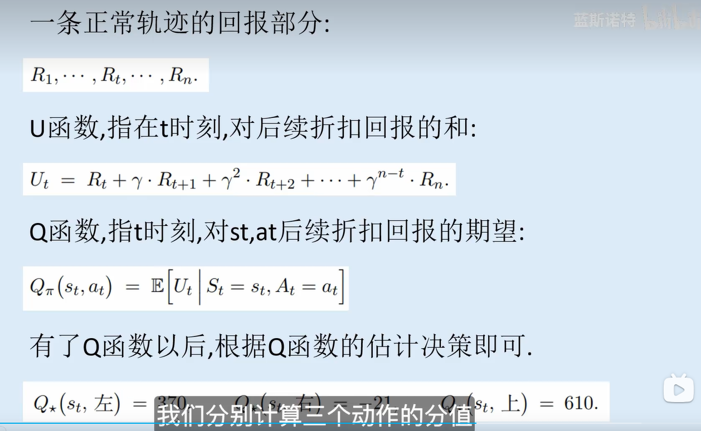
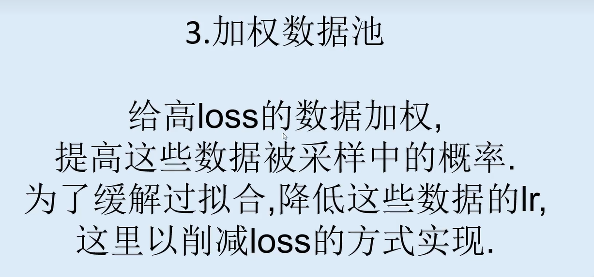

# 基础

极大似然估计

最大后验概率

[详解最大似然估计（MLE）、最大后验概率估计（MAP），以及贝叶斯公式的理解-CSDN博客](https://blog.csdn.net/u011508640/article/details/72815981)

找了很久终于确定了强化学习的学习方法。

conda如果运行虚拟环境中没有的命令，会从默认环境里面去找

# 强化学习的数学原理

# 强化学习

## 贪心策略

举例子 有十台老虎机，中奖概率各不相同

我们目前就是找到中奖率最高的一直选它

因此分为探索（随机选择）和当下最优  （根据目前已知选择中奖率最高的）

### 改进

降低探索欲望，前面知道的知识少探索多，后面探索少。例如使用倒数，前面可能1/1探索，后面1/10000的概率去探索

上置信界算法（UCB），思想就是多探索玩的少的机器，很好理解就是增加探索的效率。例如使用加权，玩的次数多的老虎机权值就低。

汤普森采样 beta分布当数字越大方差越小

## 策略迭代算法

有模型算法的定义：对于任意状态，如何选择的结构，reward等都是已知的就是有模型算法

无模型：不知道算法

以上图路径搜索为例

## 时序差分

target比value更可靠，让value靠近target，这便是时序差分的主要思路。根据计算机target，value等方式不同有了不同的算法

### Qlearing

Qlearing将下一步的行动不给予考虑，直接采用最大值

### SARSA

### 多步的TD目标

也就是说之前是

target=Q(next_S,next_a)*gamma+reward

现在是Q(next_S,next_a)*gammaxxxx 反正就是多采样几步，公式表达好难

## DQN，以及DQN的优化

QLearing使用表格来估计Q函数不便于扩展，不便于复杂情况。在DQN中用神经网络估计Q函数

### 双模型

为什么会过高估计呢？为什么双模型可以缓解过高估计？ 

模型自举会过高估计，所以在调整参数和进行估计的时候用不同的模型。

### 数据池的加权

### double DQN

在原来的双模型的基础上进行了修改，原模型计算动作，延迟模型计算target

### Dueling DQN

因为很多情况下误差并不是一个正态分布

### noise DQN

加随机误差，希望模型不要那么死板，这样可以减少模型过拟合

这些方法肯定都是可以混合使用的，个人感觉就是一些很基本的模型优化方法，和DQN本身都没有什么关系，就像是把原本神经网络的一些东西都拿过来用了。

## 策略梯度

## Reinforce

### 去基线

## AC,A2C

先训练critic网络，用于估计Q函数。actor网络用于训练策略梯度。与rf相比就是训练了crtic网络代替蒙特卡洛算法。

## PPO