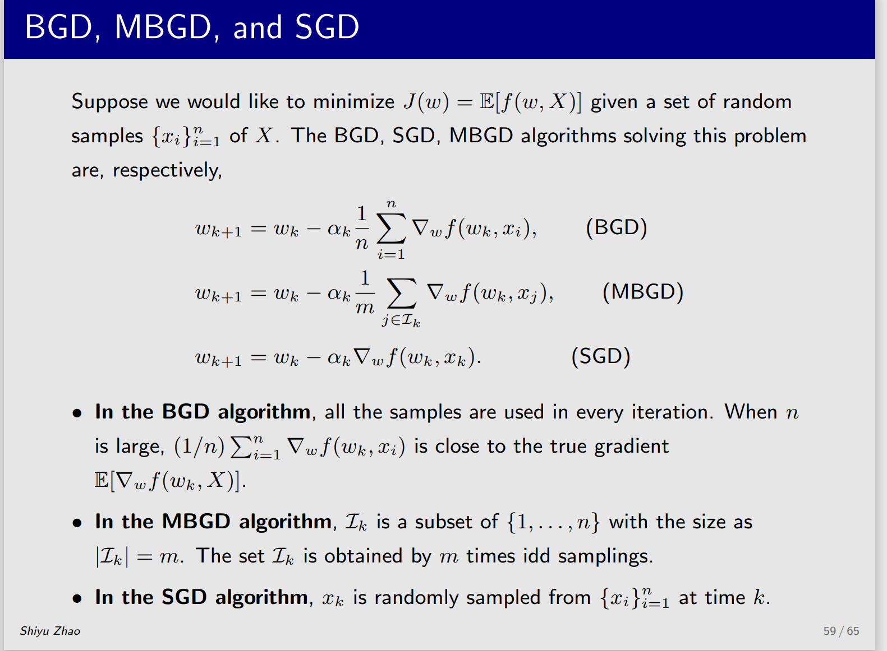

# 基本概念介绍

action，state，policy

**return**

返回值，也是一整条路径的奖励（rewards），可以反映一整条路径的好坏

下图的Gt表达式也是return

**state-value**

也就是常说的V

从定义上看，v就是在状态s，基于策略pai的return期望,此为v的定义式
$$
\nu_\pi(s)=E[G_t|S_t=s]
$$
在一条链路中

$$
\nu_\pi(s)=E[R_{t+1}|S_t=s]+\gamma E[G_{t+1}|S_t=s]
$$
这个公式表示v可以表达为当下的收益和一个未来收益，下面来表示如何计算

这是第一部分，表示在s处选择动作a后的收益

第一步是因为G（t+1）是在S(t+1)处行动的回报，所以变成

第二步基于马尔可夫假设

第三步根据v（s）的定义化解

第四步是为了提出一个pai（a|s）的公因式

通过这两步变化，等到了贝叶斯等式

**为什么要这样变化呢？**

向量形式
$$
\nu_\pi=r_\pi+\gamma P_\pi\nu_\pi
$$

# 贝尔曼最优公式

最优的概念

最优公式在数学表达式上面就是比基本的公式多了一个max/pi，在原始的情况下s状态可能有多个a，然后v（s）是选择各个a的加权平均值，而最优就是找到最佳的a，然后选择最大的。

但是如何求的最大的a呢？

首先介绍一下

前两条性质很好理解，第三条还没有搞懂证明，但是可以先明确，这可以用来迭代的求解

通过f(x)=0.5x可以很好的理解的这个性质

贝尔曼公式符合conraction mapping theorem理论

根据前面的conraction mapping theorem理论，通过迭代的方式求解,求

实际上就是让

得到最大

# 值迭代和策略迭代

值迭代就是先更新策略，然后根据更新的策略重新计算v值。前文都是用贪心策略演示的，但是贪心策略不等于策略更新。

策略迭代是先有一个随机的策略，然后计算值，（理论上）无限次计算后，v达到贝尔曼最优，再更新策略。

### 区别

所谓的初始策略再算值，或者初始值再算策略，个人感觉没区别。

区别还是在算v的时候是算一步，还是要算到收敛。值是算一步，策略是算到收敛。

truncated的方式就是算若干步，感觉被最开始的名字绕进去了。

好像思考的那么仔细意义不是很大，后面可能要加快一点了

# 蒙特卡洛算法

思想：用概率模拟期望

例如，投硬币向上为1，向下为-1，一千次一半向上一半向下那就是期望为0

model-base和model-free

mc-base  之前的贝尔曼最优的公式的优化方法 —》蒙特卡罗模拟    Gt=Gt+1  + R

mc-exploring

最本质的idea

# 随机近似和随机梯度下降

通过蒙特卡洛，我们明白期望的重要性。往往用样本的平均值去估计期望

但是获得所有样本再计算平均值效率太低。x=sum/n

于是有了迭代式求解的算法。少量样本进行估计，然后不断迭代接近平均值（期望）

实际上，这个1/k取一个其他值，满足一定条件，一样可以接近期望。

这就是SA（随机近似）算法的雏形了。SA包括随机的迭代的算法，一大类算法

类推出RM算法

RM算法的收敛性，其实RM要求很严格，所以直观上理解RM收敛很容易（概率意义上的收敛）

第一个条件是梯度为正数，不为极小值，也不为极大值。梯度为正数这个条件其实有一定说法，本身就是g（w）的导数了，导数还要单调递增，则原函数为凸函数。这里没有想明白为什么要为凸函数。

第二个条件是，ak要能够收敛，但是又不能收敛的太快，所以有了这样的条件

第三个条件则是噪音，这个条件比较宽松，一般噪声都是高斯分布，这个反而不严格要求是高斯分布。

1/k的求和真是神奇

梯度下降是一种特殊的RM算法

在梯度下降算法中，最常用的是MBGD，M的批次作为超参数需要设定

M是小批次，N是总数

SGD可以看成MBGD的M=1的特殊情况，不是很好利用GPU的并发性。BGD可以看成M=N的情况

当m=n的时候也不完全相等，因为MBGD是随机抽取，可能有缺少和重复，只是总数是相同的。

MBGD的随机性也是，当M越接近N，随机性越小。

因此，我个人认为可以在梯度下降的过程中动态调整M的大小，

但是ak也可以考虑动态调整，一起动态调整会不会不太好控制？

# TD时序差分算法

