# 过去，现在和将来

## 过去回顾历史

生产力的发展

社会问题的变化=>社会分工=>少数人的强纽带变成了很多人的弱纽带

缺少强纽带，就容易孤独

## 现在

信息匮乏=>信息过剩

注意力的丢失，信息茧房

被信息淹没，失去自主权

## 一点展望

爱情，热情等，可以慢慢被生物和化学解释~或许再无自由意志

人工智能对未来的影响

## 总结感悟

肯定要顺应时代的发展，本身我自己也算是AI方向的从事者。

正视那种孤独感，算是社会发展的必然

掌握主动权，确实也很重要，减少刷推送，尽量不要去刷。每次打开手机之前想想自己需要干什么

# 爱情的看法

## 浪漫主义

感觉靠谱吗？或许被社会所塑造，例如电视剧等

被影响，想方设法融入的痛苦

懂的越多，其实爱情就越难

## 实用主义

或许是为了更好的生活

层次越高，越难找到合适的，同时也正是因为更难找到合适的，感情也更容易稳定

## 总结感悟

讲的比较混乱，但是基本观点都和我现在一致

# 文化和意义

随着发展，个人意志和集体意志更加割裂

# 男女生存现状

过去

男性：资源提供者

女性：一定程度上仍然是附庸 1.性价值 2.生育者

资本主义时代

送礼等花钱的活动，会变成衡量爱情的一种标准

付出往往都有期待的回报，如果是经济的付出，而非经济的回报期望。（男对女）又是图什么呢？所以建议不要让他人无条件付出

男性的困境：社会洗脑的责任化和经济压力

女性的困境（从男女关系来说）：更多的非议？太弱别人看不起，太强又过去强势。不sex又无人关注，太sex会被认为xx

一直被灌输的男生要比女生强的观念。男生容易产生自卑感，影响感情。缺乏与比自己强的女生的心态。

自卑的转化，自负（敌意和贬低），施暴

男性提升形象也很重要

## 总结感悟

反而比较优秀的女生没有人追，或许可以克服自卑感，试一试。

那我还需要什么？

谈吐，内修

健身，穿搭，身材形象。

# 社交恐惧的本质

意识到交流是两个人决定的，交流不下去，对方也是有原因的。

1不用感觉全部人在看你，别把自己看得太重。 

2要对交流有好奇心，克服恐惧，做下去，观察事情的发生，而不是只把角度放在自己的感受上

3不要怕给别人添麻烦 ，所谓友情就是互相帮忙。或许从请求让别人帮一个忙，是一段关系的开始。

4假装自信， 别人不管你是真自信是假自信， 你肢体动作表达的自信就能给对方和自己自信的信号

5习惯成自然， 成功才是成功之母

## 总结感悟

对于社交最重要的就是迈开第一步，显然我已经会了。确实，有时候别人也是不知道如何应对，以及或许根本没有那么重要。

得想明白社交的意义，有些东西没有价值就没有必要去追求。

# 病态心理

## 焦虑症

影响人快乐的原因，基因来自于一半

焦虑症原来还包括这么多？

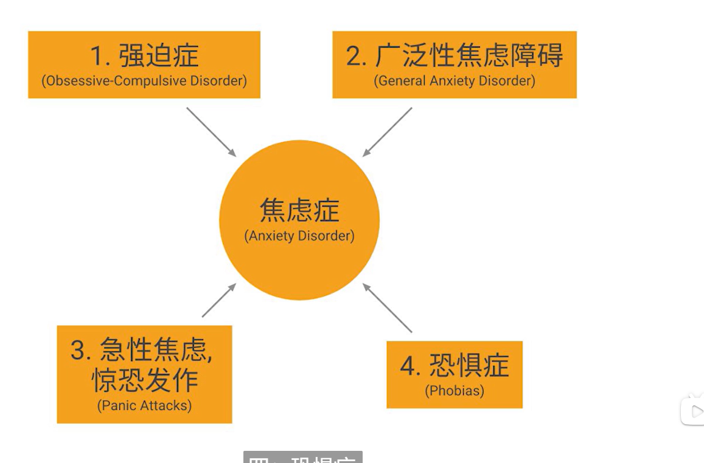

强迫症：违背意愿，无法控制的想法

广泛性焦虑比较偏日常

急性是突然性的

## 抑郁症

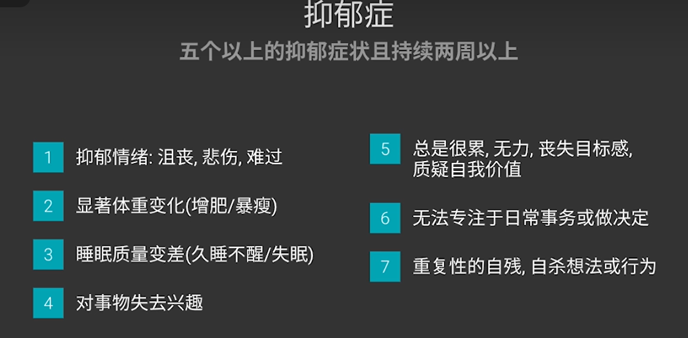

抑郁并不是单纯的快乐的反义词

## 激素角度解释

血清素，与快乐感相关的神经传递武器

去甲肾上腺素，和专注度有关

皮质醇，跟调节压力有关

### 四大快乐激素

多巴胺（欲望激素）：能带来短暂愉悦，强烈的想要做成某件事情的时候会分泌。上瘾行为的主要激素之一，之前感受过某种行为的快感，就很容易分泌多巴胺再次追求这种状态。刷短视频，很容易多巴胺劫持，不停的短暂快乐刺激，然后就是空虚。

内酚酞：**（疼痛激素）**容易在**体育运动**中分泌，或者说是一个安抚作用。当推动自己超越极限的运动时容易产生，安抚之前的痛苦。但是例如吃辣这种，也能骗过大脑分泌內酚酞。

血清素：能帮人放松心情缓解焦虑，够抵抗悲伤的物质；**（情绪调节剂）**虽然血清素不生产快乐感本身，但它控制了能不能感受到快乐的那个**闸门**。饮食不足，缺乏锻炼习惯很容易血清素不足。生活习惯不好，内分泌失调中，很重要的一个激素失调就是血清素分泌失调。

催产素：爱的激素。可以抑制负面情绪，降低防御和恐惧的感觉，增强对他人的信任。（男女都有）亲吻，拥抱等一系列行为会产生。（存疑）对于女性，在母爱和爱情中的作用是一样的，喂孩子的时候也会有。

## 行为分析

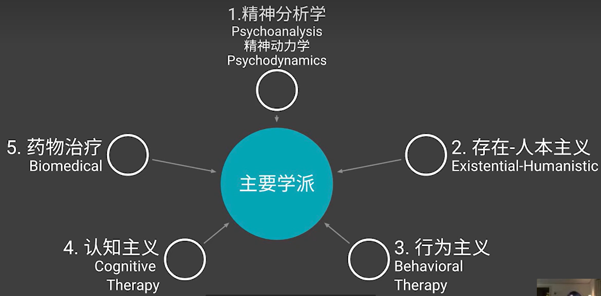

### 弗洛伊德的精神分析法

本我：原始的欲望，包括暴力，性等

超我：社会价值，道德约束

自我：本我和超我的冲突，构成自我

弗洛伊德认为本我都在潜意识中，超我和自我一部分能被意识到

自由联想，梦的解析

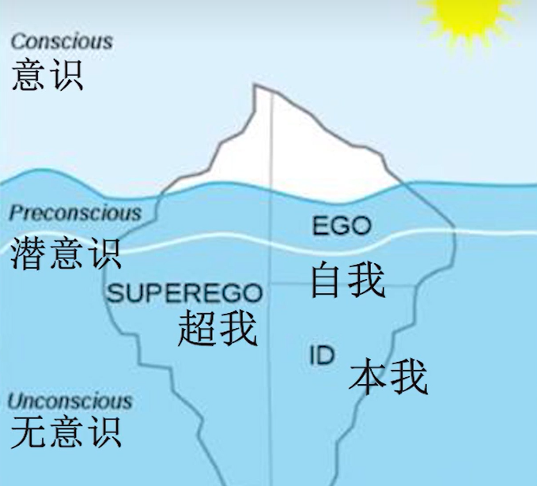

## 存在-人本主义

注重过去，未来，强调人的成长

人本主义：真诚的倾听和接受倾诉人，无道德批判，帮助接受自己

存在主义：人对于人终有一死无法想通或者恐惧。阐述人生意义，认识自我

## 行为主义

改变行为

系统脱敏。解酒瘾，喝酒，催吐，让人不想喝酒

## 认知主义

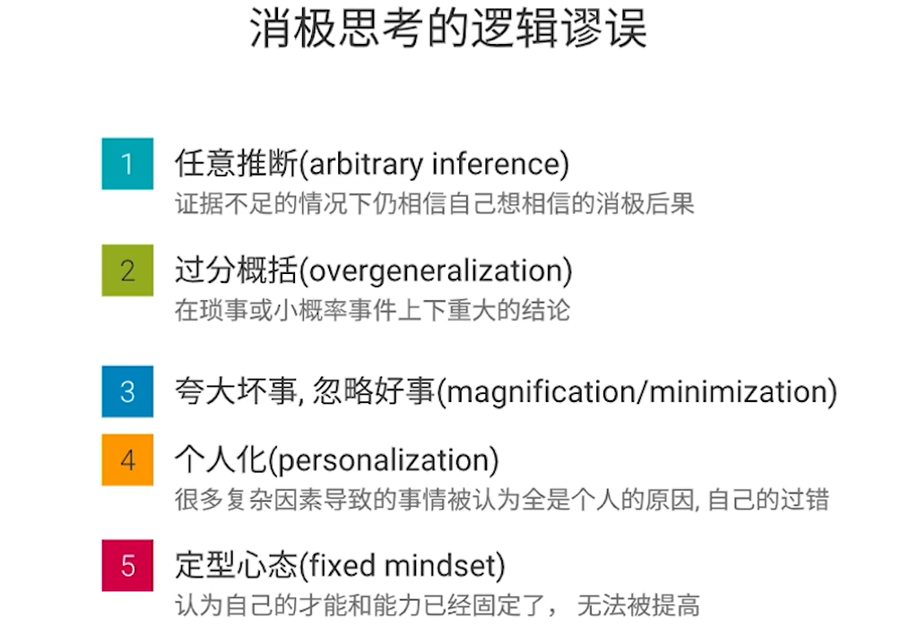

## 药物治疗

用药，电击等

# 性开放

美国的性解放运动

曾仕强的观

对于一些观点，不论是赞同或者不赞同，知道从这样一个角度去看是有益的

# 文化输出

控制他人的方式  棍棒+萝卜

新的概念: 吸引 软实力 

这样我们考虑到美国就很难第一时间考虑到，霸权主义，官僚腐败等，而是被好莱坞的‘’美国梦‘所吸引

吸引，不能让人看出来有努力吸引的想法，要看起来自然，自信，游刃有余

欧美的文化输出，男子气概可能是具有攻击性的外表，而不是责任感的落实

文化输出会影响一个人的偏见，后面会很难修正

# 消费主义和资本主义

纵观历史，横观其他国家，可以意识到很多东西不是一直以来都这样

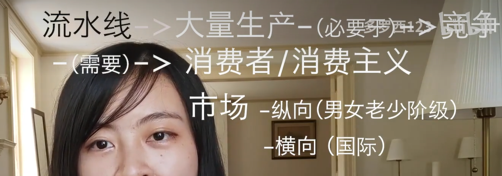

流水线生产模式开始，生产力不断发展，消费力不足，所以商家有动机促进消费，营造一种买了什么物品就是什么阶级的观念

1.资源掠夺

2.环境破坏

3.废物处理，希望消费者不断更新商品

4.市场开拓

5.传统工艺的丢失

6.工作乏味

7.贫富不均

贷款很多时间是为了刺激消费，让穷人有钱去买他们不需要的东西，会进一步加深阶级固化

通过营销，广告制造焦虑等，让人们购买商品   孤独感，无力感，无目标感最能驱动消费

## 总结

一方面我们要避免消费主义，商家很容易叛卖焦虑让我们购买不需要的东西，或者鼓吹买了什么样的物品就是什么样的人，中产消费陷阱。比如女性的粉红税，对应的男性也有。包括之前的舔狗经济，以及现在鼓吹的对自己好一点。反对消费主义，也不能走极端，不是买xxx就是陷入了消费主义的陷阱。

个人观点，首先需要消费与经济实力适配，在经济允许的范围内，能带来快乐的消费大部分都是合理的，或者说考虑一下这个快乐/金钱的性价比？其次，要正确看待别人的消费习惯，毕竟每个人的消费水平不一样，消费习惯也不一样，一定不要强加于人。最后，我还是想到了修心，或许是境界不够才会在乎这些物质，在乎别人的看法，但是那既然境界不够，想不通有没有必要强行克制自己呢？我觉得没有必要，同观点一。

# 西方哲学介绍

## 认知论

逻辑演绎  p->q

经验归纳  看到过的太阳从东边升起很多次，所以归纳太阳从东边升

缸中之脑假设

笛卡尔：我思故我在

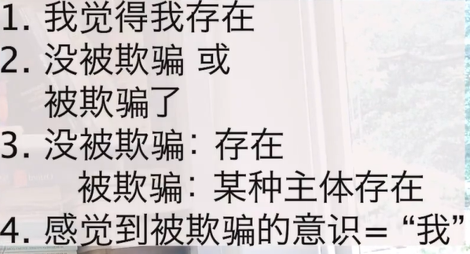

我感觉重新定义了''我'',命题中的“我”应该是代之的所谓某物质世界存在的一个‘’我''，但是如果被欺骗，则是一种意识的“我”。也就是说，笛卡尔扩充了"我"的定义范围，包括可以是一段意识

## 心灵哲学

探讨什么是心灵，意识

二元论认为意识和肉体互不相干，一元论认为是同一事物

  很多人认为脑部状态就是心灵状态，那么如果一个人失忆了怎么算呢？意识是定义身份的元素么？

人体新陈代谢，细胞全部换一遍，那还是自己么？

什么才是意识，人工智能能够算意识么？人是基因程序的编辑出来的么？和人工智能有质变还是量变，仅仅是因为现在人工智能的复杂程度还没有人这么复杂？

## 自由意志

控制不了自己的基于，控制不了自己的基于，那为什么会有自由意志呢？

一种主流的观点是，有两种意志，一种是原始的欲望，一种是对原始欲望的审视，控制。如果有第二层的意志，则认为有自由意志

## 道德

什么是道德

1.最多人的幸福最大化，功力主义的一种

2.道德并不能被量化，尊重每个人的基本权利

电车问题，功利主义会选择牺牲少人，而其二不会。

## 人生意义

虚无主义：不存在客观意义

（萨克）存在主义：存在先于本质

（加谬）荒谬主义：西西弗思推石头的故事。人生只是一个个完成无意义的目标。

## 上帝存在论证

论证1：一切的变动都有一个来由，引发最初的那个来由的就是‘“上帝”。当然这个上帝是一个抽象的概念，道生一，xxx，x生万物，道就是“上帝”

论证2：相信上帝存在更有好处

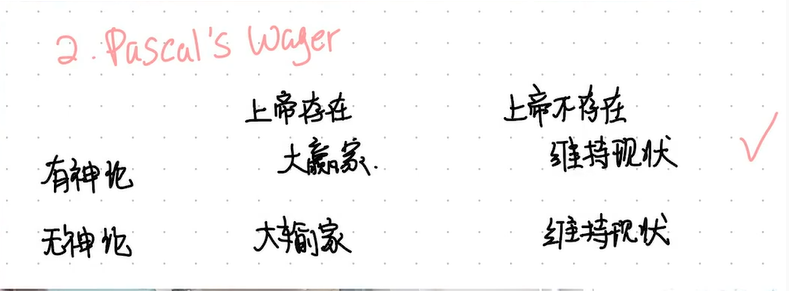

上帝往往被塑造成 全知，全能，全善

反对：上帝搬不起来石头；世界上为什么存在邪恶；

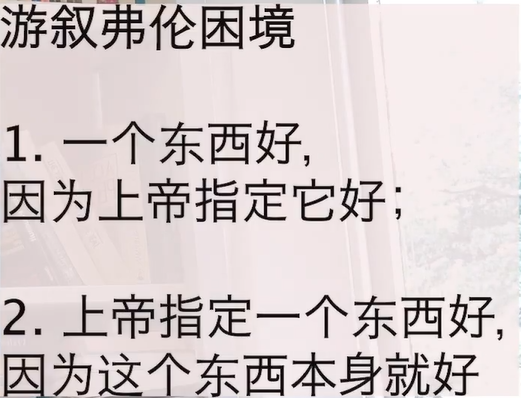

# 自媒体

随着影响力变大，责任也随时翻倍

如果创作者迎合人设，是否失去了自我？

最原始的粉丝积累需要，实力和运气

后期持续输出内容，需要有过人之处

# 媒体对女性身体健康的影响

广告可能是一个教育系统，社会教育的一部分，‘教育’什么是美的，对的，会在潜意识中影响我们。

人们会和社交媒体上的形象进行对比，产生焦虑和自卑感。商家以此来促进消费

在主流的媒体舆论中，

# 15.孤单

## 介绍

孤单某种意义上和肚子饿一样，属于需要社交，基因上解释在原始社会，一个人更难存活

从生理学也有解释

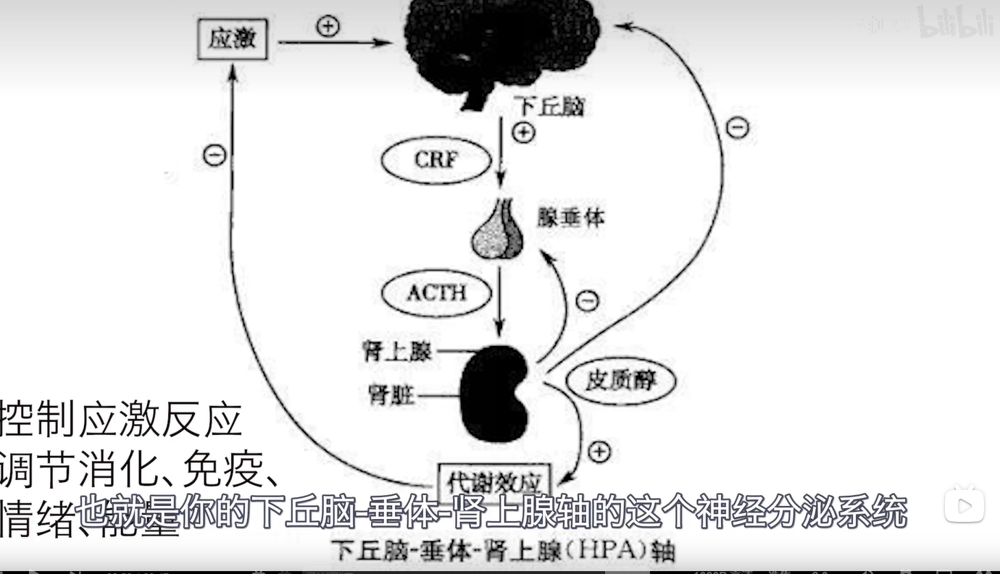

会分泌皮质醇，前文有介绍，会让人变得更加脆弱敏感

正确认识孤单，并不是可耻的事情，仅仅是提醒需要社交了。

## 男女的区别

社会对女性在这个方面更加包容，男性往往被要求不能表露太多情绪。孤独女生可以表达为悲伤，而男生可能就是愤怒，愤怒容易把人推的更远。

男性的平均寿命更低，自杀率更高，社会对男性的信任感更低。例如两个中年妇女可能会直接攀谈，但是两个男性就很难或者男性和女性会被怀疑有某种目的。男性的友谊往往来自于共同的活动，而女性可能是情感互通。

孤单很容易演变成其他问题，例如孤单导致的愤怒，可能会演变成暴力。孤单演变成对事务的上瘾。

一个讨论：男性体力更强，在社会分工时往往付出了更多的体力劳动，家庭中男性付出体力劳动更多。女性对于情感更加敏感，也更容易在乎他人的情绪。那么女性是否应该在家庭中承担更多的情绪价值呢？

## 为什么会越来越孤单

当下社会强链接的人变少，阶段性关系更多

## 如何应对

迈出第一步，主动跟别人联络

面对面的交流，尽量不要碰手机，专注交流的质量

## 我的思考

很多问题其实都和神经科学有关，应当正视

我缺乏孤独感么？当然是有的

# 17.多的博士生涯

研究生阶段，从知识的消费者变成知识的生产者

学术存在“套路化”

# 22.嫉妒

羞耻为内核，外在表示为愤怒。主要表现在看到别人和我们不相上下，却享有我们觊觎且我们没有得到的东西。

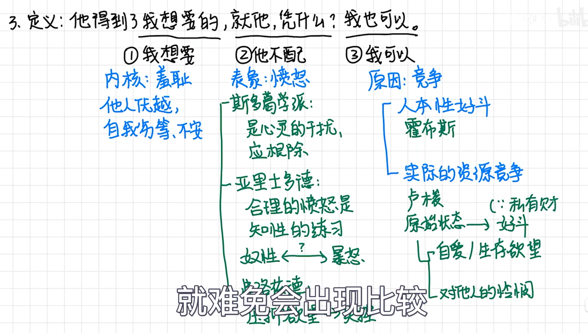

斯多葛学派：嫉妒是心灵的干扰

亚里士多德：合理的愤怒

弗洛伊德：压制欲望会失控

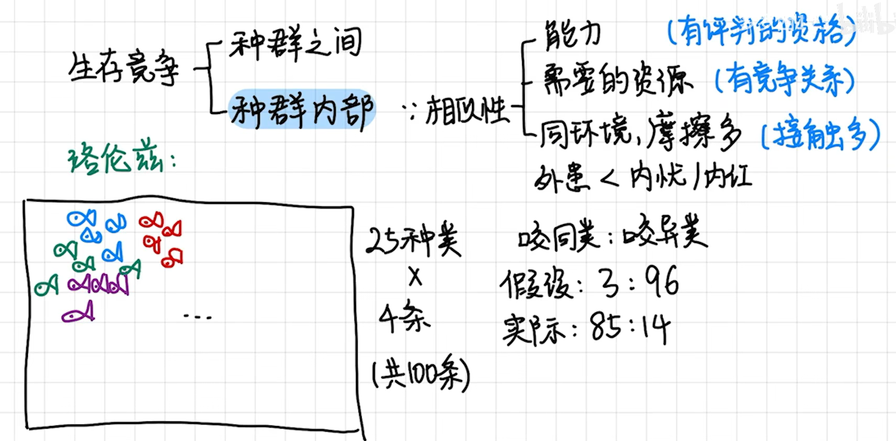

种群之间有更多的相似性，和竞争

**面对自己的嫉妒**

做一件事情的时候不会感到焦虑， 反而是拖延犹豫的时候容易焦虑

# 29进化学（男女关系）上

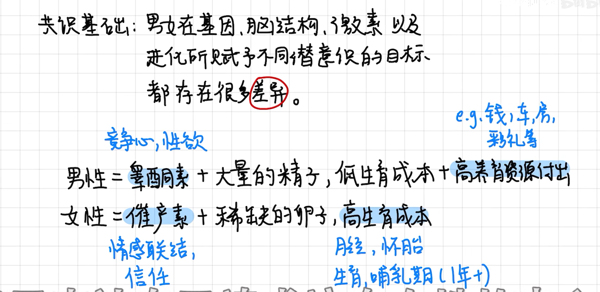

女性的理想型：有钱专一

男性的理想型：漂亮安全，低pu高mv。

也就是说女性最需要的是亲投，相对来说更害怕精神出轨，害怕失去自己的资源

男性有传递自己基因的本能

男女思维逻辑不一样

女生更需要关心，需要倾诉

男生更需要尊重，期待独立解决问题，不喜欢暴露自己脆弱的一面

女生生气大部分都是态度问题，希望获得对方的关注，获得对方的亲投。

解决问题要先解决情绪，然后再解决问题本身

**个人感觉**

一些历史规律有一定参考性，但是新时代很多东西都会变得更复杂。这种东西都只是一个base，比如现在有了很多gay，丁克，开放式婚姻等。社会越来越复杂，人的思想也变得更加多样性，良好的教化（或者说一些信仰，总之属于人类的高级思维活动）可以克服一些

# 30.面对问题不如半入半出

从上帝视角去审视整个活动，可以更好的判断，剔除一些情绪的影响 

谋定而后动，通过理论的学习先形成一个先验的知识体系，然后通过实践去验证是否正确

# 32 对事务的洞见

对事务的洞见取决于，本身的硬件性能，以及方法。

up认为本身的性能一部分是基因决定的，同时也可以后天培养。比如说从小接触自然，适当的接触社会等。当然这不是重点

## 认知事物的方法

### 感性

通过感觉经验获得表象认知

演绎法

经验主义

局限性：感官可能骗人；因果关系不绝对

### 理性

逻辑推理

笛卡尔：“我思故我在” 一切感官经验都是骗人的，说不定已经死了，或者只是在做梦

局限性：认识事物无法脱离感官；

部分隐形知识无法被抽象成知识；例如：看到红色感觉，说不定别人看到的是绿色？

### 结论

完整认知=感性+理性

大量经验->本质规律      大量的感性认知可以堆积出理性认知

很多事情都是探索的过程，比如找工作，谈恋爱等。刚开始失败很正常，积累了足够多的经验，能够比一开始靠运气成功更加长久。

### 个人感悟

一本书，思考的快与慢

[《思考，快与慢》)](https://zhuanlan.zhihu.com/p/128660508)

最有价值的点还是在于对心态的调整，对于找工作等事情，有了失败也不可怕的想法

或许我应该尝试多从感性和理性的角度分析自己的想法？

这个和对大语言的里面有相关性，语言模型不也是从知识获取的么？但是人的研究好像是知识加数据驱动，在不知不觉中其实有逻辑推理。大语言模型会不会有呢？或许不是知识本身有，而是我们人没有认识到的人脑逻辑里面有的，tf这种底层可能就没有。

# 1.人际剖析 魅力

一部分人存在感强，有气场的来源是？

## 个人行事的框架

或者说每个人的行为逻辑，很多时候两个人交流的过程中都是对对方行为逻辑的一个了解过程

## 能量

很多人会看别人的能量，综艺评委人等。

up主给的解释是积累的实力呈现出来的一个表现

## 实力

价值+稀缺性

社会幕强。

事物本身就是有两面性的，比如沉默寡言，有实力就是褒义，没实力就是情商低。

二八法则，马太效应

实力=绝对实力+稀缺度

提升实力要找到自己的优势和兴趣

## 个人思考

看多多的视频，经过会有一种共情的感觉，就是想到过类似的，但是没有这么系统被她总结出来了。

与人交流的时候，尽量找与自己合拍的。当然也多多理解别人的想法，只不过不合适就没必要深交了。

我想要成为有魅力的人，需要提高自己的实力。

我的想法就是强大的专业知识，加上各项杂技能，开车做饭等等。

# 2.人际剖析

阳光，空气水等高价值，但是并不具备稀缺性

## 构建稀缺性

信息，知识，能力，认知，资源

 当今社会信息过剩，会搜索信息就是一个重要的信息

知识的积累，不能简单收集到信息。

将知识表达出来，运用出来也是一种能力。知识可以是学来的，能力一定是用出来的。

认知，从更高的维度，从未来，从他人角度去看待问题。多和人交流，更有学识的人交流，吸收

资源 供货商，客户等。人脉，不是单纯你帮他或者他帮你，需要能互相帮得上忙的。

## 个人感悟

当你想很多，你得到的全部都是问题；当你行动，你得到的全都是答案。

好像很多东西我都想到过，以至于学习了这些之后还是不知道应该怎么做。嗯，但是整理一下思路，明白自己的一些想法，也能被系统的表达出来也是有意义的。

# 3.人际剖析

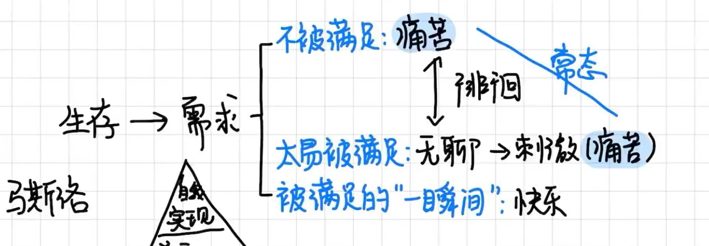

痛苦的本质：需求得不到满足

太容易满足的需求，不会带来太大的快乐，反而会很快陷入无聊，因此很容易在无聊和痛苦之间徘徊。想清楚痛苦是常态，也就没有那么痛苦了。

面对他人的攻击，很多时候只是攻击某个人的某个部分，我们可以从一个更高的境界去化解。

# 4.人际关系

追求主观意识拥有的状态，再转变为拥有

改变自己都这么困难，更加不要想着改变其他人。无非是嘴巴皮子动一动比较简单

吸引都是被一个人的”世界“所吸引

# 李道长的世界观

《时间足够你爱》

一个人应该能够给孩子换尿布、计划一次侵略行动、杀猪、驾驶飞船、设计建筑物、写诗、做会计账目、砌墙、接合断骨、照顾临终的人、执行命令、下达命令、与人合作、独立行动、解方程式、分析一个新问题、施肥、编程、做一餐美味的饭、高效地战斗、勇敢地死去。专业化是为昆虫准备的。

# 其他

## 马斯洛需求金字塔

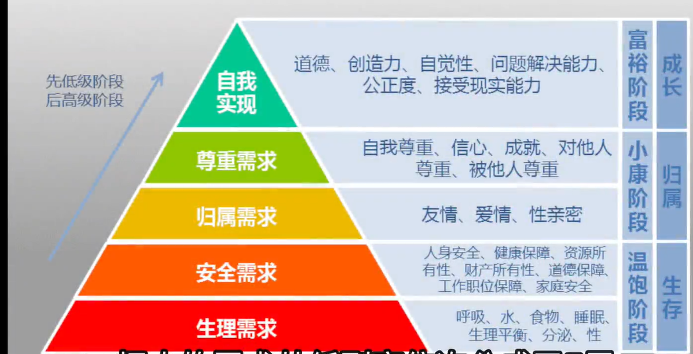

我个人总是对于归属需求感觉不是很高，或许我追求是自我实现。

up主最后提出的内心秩序，和阳明心学的致良知很像。

心即理，知行合一，致良知

## 其他

**“很多人为了逃避真正的思考，愿意做任何事情。”**