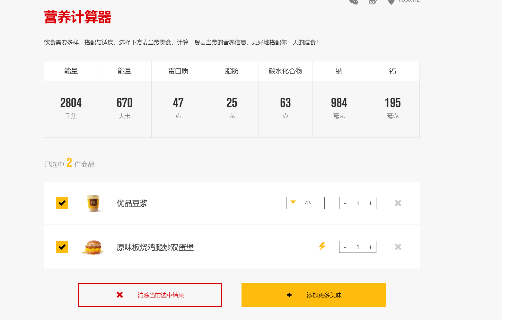
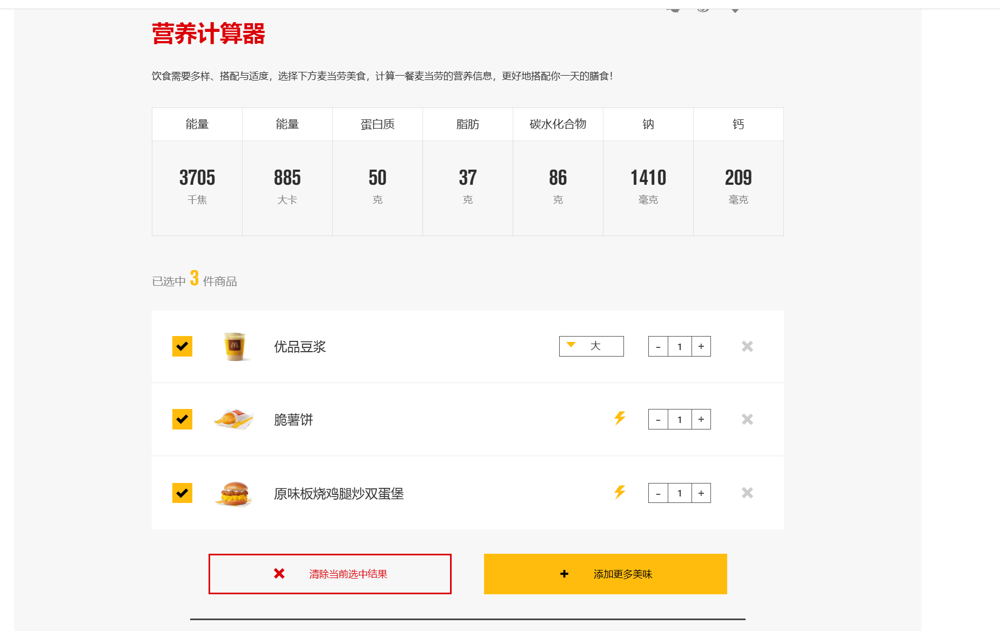

# 减脂

## 7.25

净重: 70.0kg

早上健身，胸

|           | 饮食                              | 碳水 | 蛋白质 | 脂肪 |
| --------- | --------------------------------- | ---- | ------ | ---- |
| 练前      | 欧包一个                          | 29   | 4      | 1    |
| 早饭/练后 | 麦当劳                            | 63   | 47     | 25   |
| 中饭      | 欧包一个 +蛋白粉一勺（下午） | 28   | 4+20   | 1    |
| 晚饭      | 小面+鱼蛋三个+鸡蛋两个            | 55   | 20     | 40   |

面条没拍

g，晚上本来打算吃称重菜的，结果去早了没开门，吃的重庆小面碳水和脂肪好多！！

## 7.26

练的背，顺便补了昨天的三头

寝室的称 69.45kg

健身房的

|           | 饮食     | 碳水 | 蛋白质 | 脂肪 |
| --------- | -------- | ---- | ------ | ---- |
| 练前      | 欧包一个 | 29   | 4      | 1    |
| 早饭/练后 | 麦当劳   | 86   | 50     | 37   |
| 中饭      |          | 28   | 4+20   | 1    |
| 晚饭      |          | 55   | 20     | 40   |

